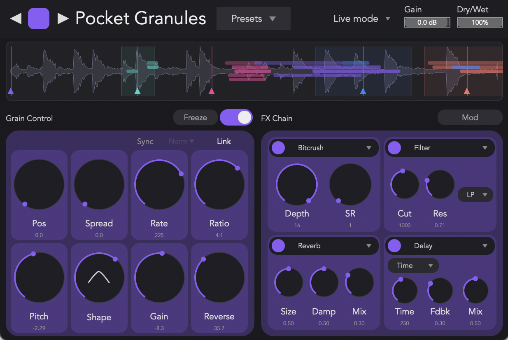

# PocketGranules: Multihead Granulator

[](../../releases/latest)
[](LICENSE)
[](#downloads)
[](#downloads)
[](https://juce.com)

A real-time multi-head granular synthesizer for VST3 and AU hosts, built in JUCE/C++. Five independent grain engines run in parallel, each with its own freeze, pitch, FX chain, and grain DNA, driven by a deep modulation rig (5 LFOs, step sequencer, envelope follower) that wires to any knob — grain or FX — with per-connection bipolar amount.



---

## Downloads

Pre-built binaries (macOS arm64) are attached to each release:

**→ [Get the latest release](../../releases/latest)**

| Format | Install path |
|---|---|
| VST3 | `~/Library/Audio/Plug-Ins/VST3/PocketGranules.vst3` |
| AU   | `~/Library/Audio/Plug-Ins/Components/PocketGranules.component` |

After moving the bundle into place, restart your DAW (or invalidate its plugin cache) so it rescans.

For Intel Macs, Windows, or Linux, [build from source](#building-from-source).

---

## Features

### Five granular heads
- Independent **enable**, **freeze**, **position**, **spread**, **rate**, **length**, **pitch**, **shape**, **gain**, and **reverse** per head
- Per-head **size-link** chains grain length to grain rate (overlap compensation)
- Per-head **tempo sync** for grain rate (8/1 → 1/64) with straight / dotted / triplet
- Compact single-head UI with arrow navigation between heads, color-coded per engine

### Per-head FX chain
- Four FX slots per head, choose any of: **Filter** (LP/HP/BP) · **Bitcrusher** · **Delay** (free or sync) · **Reverb**
- All FX parameters are modulation targets

### Modulation system
- **5 LFOs** with selectable shape (Sine / Tri / Saw↑ / Saw↓ / Square / Sample&Hold), free or sync rate, depth, phase
- **16-step sequencer** with 4 play modes (Forward / Reverse / Ping-pong / Random), pattern length, smoothing, sync
- **Envelope follower** with sensitivity, rise, fall — feeds input loudness into mod
- Click **Assign** on any source, then drag the colored collar around any knob to set amount
- **Option-click** a connection to toggle bipolar / unipolar
- **Right-click** a connection to bypass / remove

### Audio source
- **Live mode**: incoming audio is granulated in real time
- **File mode**: load a sample, granulate from it, scrub freely
- Per-grain **freeze** captures the current ring-buffer slice and loops it

### Project & UX
- Presets menu (Save / Load / Init)
- Top-bar gain and dry/wet horizontal sliders
- All parameters exposed via APVTS, fully automatable from the host

---

## Building from source

### Requirements
- CMake ≥ 3.15
- A C++17 compiler (Xcode on macOS, MSVC on Windows, GCC/Clang on Linux)
- [JUCE](https://github.com/juce-framework/JUCE) checked out as a sibling of this repo (see `CMakeLists.txt:5` — `JUCE_DIR` is `${CMAKE_CURRENT_SOURCE_DIR}/../JUCE`)

### Build
```bash
git clone https://github.com/molgenzo/CerberusGran.git
cd CerberusGran
git clone https://github.com/juce-framework/JUCE.git ../JUCE  # sibling

cd CerberusGran                       # the inner CMake project lives here
cmake -B build -DCMAKE_BUILD_TYPE=Release
cmake --build build --config Release -j
```

The build copies the AU and VST3 bundles to system plug-in folders automatically (see `CMakeLists.txt:64-79`). To skip that, comment out the `add_custom_command` blocks at the bottom of `CMakeLists.txt`.

### Output
Built artefacts land in `CerberusGran/build/PocketGranules_artefacts/Release/`:
- `VST3/PocketGranules.vst3/`
- `AU/PocketGranules.component/`

---

## Project structure

```
CerberusGran/
├── CMakeLists.txt              # JUCE plugin definition + post-build install
├── Source/
│   ├── PluginProcessor.{h,cpp} # AudioProcessor, APVTS, modEngine ticks
│   ├── PluginEditor.{h,cpp}    # top-level editor, advanced panel toggle
│   ├── Parameters.h            # APVTS layout (per-head + per-source params)
│   ├── GrainEngine.{h,cpp}     # owns all 5 heads, dispatches per-block work
│   ├── GrainHead.{h,cpp}       # single head: schedules grains, applies FX
│   ├── Grain.h                 # one grain's lifecycle: window + pitch read
│   ├── HeadFXChain.h           # 4 FX slots: filter, crush, delay, reverb
│   ├── RingBuffer.h            # live-input recorder
│   ├── Modulation/
│   │   ├── LFO.h               # 5 instances, race-free static shape eval
│   │   ├── StepSequencer.h     # 16 steps, 4 play modes
│   │   ├── EnvelopeFollower.h  # one-pole, sens/rise/fall
│   │   └── ModulationEngine.h  # connection list, applyMod() helper
│   └── UI/
│       ├── EngineColumn.h      # one head's panel, mod-collar overlays
│       ├── FXSlotCard.h        # one FX slot, type selector
│       ├── FXChainPanel.h      # 4-slot grid
│       ├── GlobalBar.h         # top bar (presets, live mode, gain, mix)
│       ├── AdvancedPanel.h     # tabbed mod source editor
│       ├── LFOPanel.h
│       ├── StepSequencerPanel.h
│       └── EnvelopeFollowerPanel.h
└── images/                     # README assets
```

### Audio-thread data flow
Each block, `PluginProcessor::processBlock` does:

1. Feed input into `RingBuffer` and into `modEngine.envFollower`
2. `modEngine.tickSources(numSamples, sampleRate, bpm)` advances every LFO / step seq output
3. `updateParametersFromAPVTS()` reads each modulatable param and wraps it: `modEngine.applyMod(paramId, baseValue, min, max)` — accumulates `Σ source.output * connection.amount`, interpreted bipolar/unipolar per connection
4. Each `GrainHead` schedules + renders grains; FX chain runs per slot
5. Sum heads → master gain / dry-wet → output

Modulation connections are stored in a `std::vector` mutated only on the message thread; the audio thread iterates a const snapshot.

---

## Release notes

### v0.1.0 — first public release
- 5-head granular engine with independent freeze, pitch, position, spread, rate, length, shape, reverse, gain
- Per-head FX chain (Filter / Bitcrusher / Delay / Reverb)
- Modulation system: 5 LFOs + 16-step sequencer + envelope follower
- Per-connection bipolar amount (Option-click in assign mode)
- Live + File audio source modes with sample loading
- Tempo sync for grain rate, delay time, modulation rates
- Compact single-head UI with arrow navigation
- Presets menu (Save / Load / Init)
- macOS arm64 binaries shipped

#### Known limitations
- Editor-only state (current head shown, modulation panel open/closed, FX slot type per slot) is **not** persisted across project reloads — these always revert to defaults
- Only macOS arm64 binaries shipped this release; Intel / Windows / Linux must build from source

---

## License

Released under the [MIT License](LICENSE). JUCE is used under its own license terms — see [juce.com](https://juce.com/get-juce/) for details on JUCE's commercial / GPL options.

## Credits

Developed by Ishaan Jagyasi as part of ASE coursework, Georgia Tech (Spring 2026). Built on the [JUCE](https://juce.com) framework.

---

The original CerberusGran project README has been preserved at [`old_readme/README.md`](old_readme/README.md).
